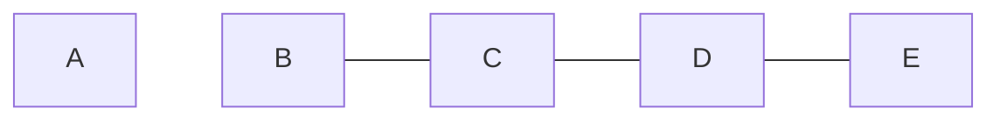

---
tags:
  - algoritmi
  - reti
  - instradamento
---
L’algoritmo **Distance Vector** è una delle famiglie fondamentali di [[Instradamento#Algoritmi|algoritmi di instradamento]] nelle reti di comunicazione. Si basa su un’idea concettualmente semplice: ogni router diffonde periodicamente (o quando cambia qualcosa) la propria “visione” della rete ai vicini, sotto forma di tabella di distanze, e tutti aggiornano le proprie tabelle in base alle informazioni ricevute. Il materiale che segue riprende ed estende i concetti presenti nelle slide fornite, approfondendone il funzionamento, i problemi (in particolare il _count-to-infinity_) e l’analisi di efficienza.
## Funzionamento

1. Ogni router (indicato anche come **IS**) mantiene una tabella di instradamento in cui, per ogni destinazione nota, memorizza almeno:
    - il **costo** del cammino migliore verso quella destinazione;
    - il **prossimo hop** (il vicino a cui inoltrare i pacchetti).

2. Periodicamente, oppure ogni volta che la tabella cambia, ogni router invia ai router adiacenti (vicini) una tabella sintetica, detta **distance vector**, che contiene:
    - per ogni destinazione nota, la distanza (costo stimato) a quella destinazione vista da quel router.

3. I dettagli locali (per esempio i nomi delle interfacce, parametri specifici della macchina, ecc.) non vengono inclusi nel distance vector: si diffonde solo la parte “essenziale” della tabella di instradamento.

In altre parole, ciascun router comunica ai vicini: “Secondo me, la destinazione X costa $c$”. I vicini integrano queste informazioni nella propria visione della rete, aggiornando le loro tabelle secondo l'algoritmo di Bellman-Ford. L'algoritmo distribuito di Bellman-Ford è completamente asincrono e parte da stime arbitrarie, ma converge a una soluzione ottima se la topologia e i pesi dei link rimangono costanti per un tempo sufficiente.
### Apprendimento delle destinazioni

​L’apprendimento delle destinazioni avviene tramite un processo di _passa-parola_ (gossip).

- Nello **stato iniziale** ogni router conosce solo:
    - se stesso;
    - le reti (o i nodi) direttamente connessi alle proprie interfacce, con il costo delle linee di accesso.

- Quando un router riceve un **distance vector** da un vicino, per ogni destinazione $d$ contenuta in quel vettore:
    1. prende il costo di $d$ dichiarato dal vicino: $C_{vicino}(d)$; 
    2. vi **somma** il costo della linea di ingresso $C_{linea}$ tra sé e quel vicino;
    3. ottiene così un costo candidato: $C_{nuovo}(d)=C_{vicino}(d)+C_{linea}$.

Se questo nuovo costo è **minore** del costo finora noto verso $d$, il router:
1. aggiorna nella propria tabella il costo di $d$;
2. imposta come **next hop** il vicino da cui ha ricevuto l’informazione;
3. innesca eventualmente la trasmissione di un nuovo distance vector ai vicini, per propagare la “buona notizia” (un cammino più conveniente).

Le destinazioni si diffondono dunque nella rete cammino dopo cammino: si parte dal nodo direttamente connesso e la notizia “c’è una destinazione X a distanza k” si propaga router dopo router.
### Metriche

La **metrica** è la funzione con cui si valuta il “costo” di un cammino. Alcuni esempi:
- Numero di **hop** (numero di router attraversati).
- Somma di pesi associati ai link (latenza, banda inversa, congestione, combinazioni di questi fattori).

Può esistere anche una politica di **priorità** tra *più* metriche, ad esempio:

1. Prima minimizzare il **costo totale**.
2. A parità di costo, minimizzare il **numero di hop**.
3. A parità di costo e di hop, scegliere **casualmente** un cammino (per bilanciare oppure rompere la simmetria).

Nel distance vector, per ogni destinazione, il router memorizza sia:

- il **costo complessivo** del cammino verso la destinazione;
- il **prossimo hop** da usare.

### Invio dei vettori e convergenza

Esistono due principali politiche per l'invio dei **distance vector**.
#### Aggiornamenti reattivi

Invio di un distance vector **ogni volta che** la tabella di instradamento viene modificata (per esempio quando si trova un nuovo cammino più conveniente o quando un link cambia costo).
#### Aggiornamenti periodici

Invio di un distance vector **a intervalli regolari** (per esempio ogni T secondi), anche se non ci sono cambiamenti.

>[!info] Scelta dei nodi da aggiornare
>- Se i nodi adiacenti sono noti (tramite un protocollo di scoperta dei vicini), si può inviare *unicast* solo a loro.
>- Se non si conoscono in anticipo i vicini, i distance vector possono essere inviati in *multicast* su un opportuno gruppo, cosicché raggiungano tutti i router interessati.

>[!warning] Tempo di convergenza
>Uno dei problemi principali degli algoritmi distance vector è la **lentezza nella convergenza**, soprattutto:
>- in reti di grandi dimensioni;
>- in presenza di degradazioni della topologia di rete (guasti di link o router).

Per questo motivo, è difficile usare il puro distance vector in reti con *più di un migliaio* di nodi: la convergenza può diventare troppo lenta e il traffico di aggiornamento troppo elevato.

## Count-to-infinity
Uno degli aspetti più critici degli algoritmi distance vector è il problema del **count-to-infinity** (contare all'infinito). Il nocciolo del problema è che se un router A dice a B di avere un percorso verso una destinazione, B non ha modo di sapere se quel percorso include B stesso.

L’osservazione fondamentale è che:
- Gli algoritmi distance vector **reagiscono velocemente alle “buone notizie”** (nuovi cammini più corti).
- **Reagiscono invece molto lentamente alle “cattive notizie”** (rottura di un link, aumento di costo, disconnessione).
​​
### Buona notizia

Si consideri una rete in cui inizialmente la linea tra i router A e B è **guasta**, e la metrica è il numero di hop.

All'inizio (tempo $t=0$), B, C, D, … hanno distanza “infinita” da A (non esiste un cammino). Solo A ha distanza 0 da sé stesso.

Quando la linea A - B viene riparata, A e B aggiornano le proprie tabelle:
- A scopre che B è a distanza 1;        
- B scopre che A è a distanza 1.

Questa _buona notizia_ si propaga attraverso la rete:
- a $t=1$, qualche vicino di B scopre che A è a 2 hop;
- a $t=2$, i vicini dei vicini scoprono A a 3 hop, e così via.

$$
\begin{array}{c|ccccc}
t & A & B & C & D & E \\ \hline
0 & 0 & \infty & \infty & \infty & \infty \\
1 & 0 & 1 & \infty & \infty & \infty \\
2 & 0 & 1 & 2 & \infty & \infty \\
3 & 0 & 1 & 2 & 3 & \infty\\
4 & 0 & 1 & 2 & 3 & 4
\end{array}
$$

In generale, una buona notizia su un certo cammino nuovo e migliore si propaga in **k passi** se la destinazione è a distanza $k$ in hop: servono tanti cicli di aggiornamento quanti sono i router da attraversare.

### Cattiva notizia

Si consideri ora che la linea A - B vada di nuovo **fuori servizio**.

Il problema è che:

- I router vicini non hanno immediatamente la certezza che **non esista più alcun cammino** alternativo verso A tramite altri nodi.
- Ogni router può temporaneamente credere che la destinazione sia ancora raggiungibile “passando per qualcun altro”, perché riceve distance vector che riportano distanze finite (anche se basate su informazioni ormai obsolete).

Il risultato tipico è una sequenza di tabelle in cui la **distanza verso A aumenta lentamente** fino a raggiungere un valore che viene considerato “*infinito*”.

$$
\begin{array}{c|ccccc}
t & A & B & C & D & E \\ \hline
4 & 0 & 1 & 2 & 3 & 4 \\
5 & 0 & 3 & 2 & 3 & 4 \\
6 & 0 & 3 & 4 & 3 & 4 \\
7 & 0 & 5 & 4 & 5 & 4 \\
8 & 0 & 5 & 6 & 5 & 6 \\
9 & 0 & 5 & 6 & 7 & 6 \\
\vdots & \vdots & \vdots & \vdots & \vdots & \vdots \\
? & 0 & \infty & \infty & \infty & \infty
\end{array}
$$

Questa dinamica è il **count-to-infinity**. I router “contano verso l’infinito” (incrementano ripetutamente il valore della metrica) prima di dichiarare A irraggiungibile.

Un effetto simile può verificarsi anche in configurazioni molto semplici (per esempio reti con pochi nodi), se i router continuano a “rimbalzarsi” distanze tra loro basate su vecchie informazioni.

### Scelta dell'infinito

Poiché in pratica non si può lasciare che il conteggio cresca indefinitamente, gli algoritmi distance vector introducono un **valore convenzionale di infinito**:

- Una distanza superiore o uguale a questo valore viene considerata *non raggiungibile*.

- Il tempo necessario perché una _cattiva notizia_ (perdita di connettività) si propaghi è funzione del valore scelto per **infinito**.

- In genere, si sceglie come infinito la **lunghezza del cammino più lungo più 1**: se il cammino semplice più lungo nella rete ha al massimo $L$ hop, si sceglie $\infty=L+1$.

Nell'esempio delle slide, viene proposto un valore convenzionale di infinito pari a 5:

- Se la linea A - B va fuori servizio, la cattiva notizia si propaga in circa ∞−1=4∞−1=4 passi: i valori aumentano fino a stabilizzarsi a 5 (infinito) per tutti i router, che quindi segnano A come non raggiungibile.

Nel protocollo [[RIP]], il valore di infinito è **16 hop**, che rappresenta la metrica massima per una destinazione raggiungibile. Questo limite è stato scelto perché la maggior parte delle reti locali ha un diametro molto inferiore a 16 hop, e questo valore permette di contenere il count-to-infinity entro limiti gestibili.