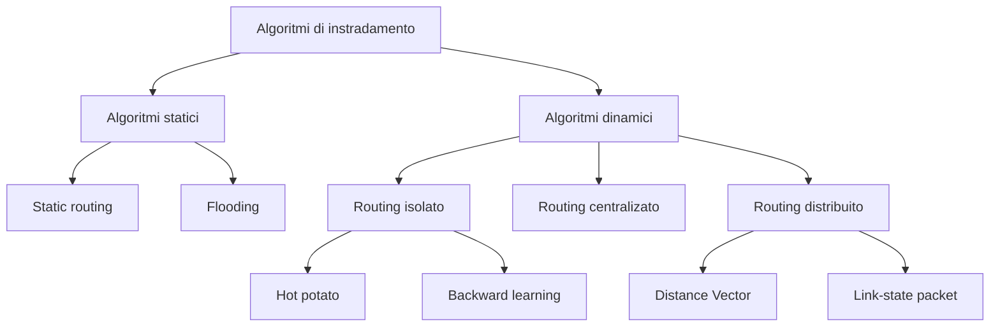

---
tags:
  - algoritmi
  - instradamento
  - reti
---
L'**instradamento** (routing) è un processo globale che determina il percorso che intraprende un pacchetto IP lungo tutta la rete dal sistema mittente a quello destinatario. 

L'**inoltro** (forwarding) è un processo locale al router per trasferire un pacchetto da un link di ingresso a un link di uscita.

>[!tip]
>Ogni host è *direttamente connesso* a un router quindi il problema dell'instradamento si riduce all'instradamento del pacchetto dal router sorgente al router destinatario.

Un **protocollo** di routing è un processo di comunicazione tra i router per scambiarsi informazioni utilizzate per formare la tabella di routing.

Il funzionamento di ogni protocollo è retto da un **algoritmo** di routing che determina il percorso da seguire per ciascun pacchetto.
## Algoritmi

### Qualità degli algoritmi

Gli algoritmi di instradamento sono fondamentali per il corretto funzionamento di una rete.  Si usano diversi criteri per scegliere il giusto algoritmo da implementare.
#### Efficienza

Gli algoritmi dovrebbero essere abbastanza efficienti nel calcolo dei cammini verso la destinazione per evitare che questo abbia un peso eccessivo rispetto all'instradamento dei pacchetti. Questo è un requisito importante soprattutto nelle reti più complesse, con grandi tabelle di instradamento, in quanto i processori e le memorie attualmente disponibili sui router sono talvolta insufficienti.
#### Ottimalità

Normalmente, per calcolare l'ottimalità di un algoritmo, vengono usate metriche come il numero di hop su cui deve passare un pacchetto o il costo delle linee su cui transita. Di solito queste sono metriche statiche perché tenere in considerazione il carico corrente della rete è complicato.
#### Robustezza

Un buon algoritmo di instradamento dovrebbe essere affidabile e potersi adattare a variazioni della topologia della rete. In reti di grandi dimensioni si presentano spesso delle variazioni, come dei guasti a linee o router.
#### Stabilità

Se l'algoritmo ha scelto un determinato percorso verso una destinazione, allora quel cammino dovrebbe restare tale finché non si presenteranno variazioni alla topologia della rete. Quando accade, l'algoritmo dovrebbe essere in grado di convergere velocemente verso un nuovo percorso.
#### Equità

Tutti i nodi della rete devono essere trattati allo stesso modo. Non ci possono essere nodi privilegiati o danneggiati.
#### Economicità

L'algoritmo dovrebbe avere costi ridotti di manutenzione e configurazione

>[!note] Difficoltà nella scelta
>I criteri per la scelta del giusto algoritmo possono essere contrastanti tra loro. Ad esempio, non si può minimizzare il ritardo di pacchetti e massimizzare l’utilizzo delle linee allo stesso tempo senza introdurre dei compromessi. Gli algoritmi più complessi possono comportare configurazioni difficili e costi più alti di manutenzione a causa del personale richiesto per la gestione.

### Tipi di algoritmi
#### Algoritmi statici

I criteri di instradamento usati per calcolare i percorsi sono fissi, indipendenti dallo stato della topologia. In questa categoria rientrano gli algoritmi di [[Flooding]] e [[Static Routing]].
#### Algoritmi dinamici

L'algoritmo tiene conto del carico e/o della topologia corrente della rete per instradare i pacchetti.
Questo comportamento può essere diviso in due grandi categorie:
- negli algoritmi di *routing isolato* ogni IS prende le decisioni usando solo le loro informazioni locali. Gli algoritmi [[Hot Potato]] e [[Backward Learning]] sono di questo tipo.
- negli algoritmi di *routing distribuito* gli IS si comunicano tra loro informazioni sulla rete. Gli algoritmi [[Distance Vector]] e [[Link State Packet]] sono algoritmi di questo tipo. 

È anche possibile che nella rete sia presente un unico apparato dedicato alla gestione dell'instradamento di tutti gli IS. In quel caso si parla di [[Routing Centralizzato]].

>[!tip] Rapporto tra routing statico e dinamico
>Il routing statico è preferito nelle parti periferiche della rete, in cui si ha una topologia prevalentemente ad albero e poche variazioni nel tempo. Al contrario, il routing dinamico è preferito nella parte centrale della rete, in cui è presente una topologia fortemente magliata e molte variazioni.

## Protocolli

Gli **Interior Gateway Protocols** (IGP) sono definiti come i protocolli usati all'interno di un unico dominio amministrativo, tipicamente la rete di un singolo *ISP* o di un’azienda; esempi sono [[RIP]], [[OSPF]] e [[IS‑IS]]. Gli **Exterior Gateway Protocols** (EGP) invece servono a scambiare informazioni di routing tra domini amministrativi diversi, cioè tra [[Autonomous System]], ed è in questa categoria che rientrano l’originario EGP storico e l’attuale [[BGP]].

>[!important] Separazione tra interno ed esterno
La separazione tra IGP ed EGP è motivata sia da problemi tecnici (scalabilità, dimensione delle tabelle, convergenza) sia da problemi amministrativi e di policy: ciascun provider è libero di usare qualunque IGP internamente, ma serve un protocollo comune per scambiare rotte verso l’esterno, supportando vincoli commerciali e politiche di transito o peering.
