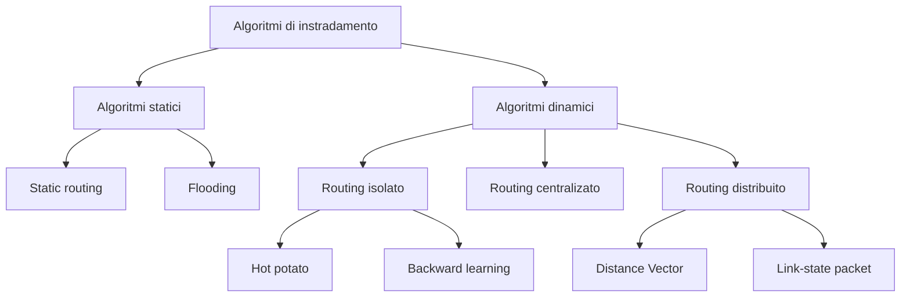

---
tags:
  - algoritmi
  - instradamento
  - reti
---
L'**instradamento** (routing) è un processo globale che determina il percorso che intraprende un pacchetto IP lungo tutta la rete dal sistema mittente a quello destinatario. 

L'**inoltro** (forwarding) è un processo locale al router per trasferire un pacchetto da un link di ingresso a un link di uscita.

>[!tip]
>Ogni host è *direttamente connesso* a un router quindi il problema dell'instradamento si riduce all'instradamento del pacchetto dal router sorgente al router destinatario.

Un **protocollo** di routing è un processo di comunicazione tra i router per scambiarsi informazioni utilizzate per formare la tabella di routing.

Il funzionamento di ogni protocollo è retto da un **algoritmo** di routing che determina il percorso da seguire per ciascun pacchetto.
## Algoritmi

